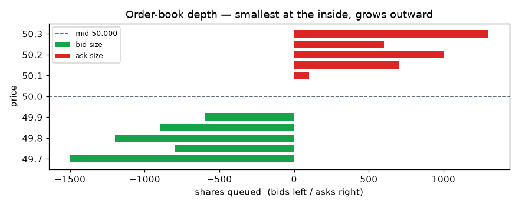
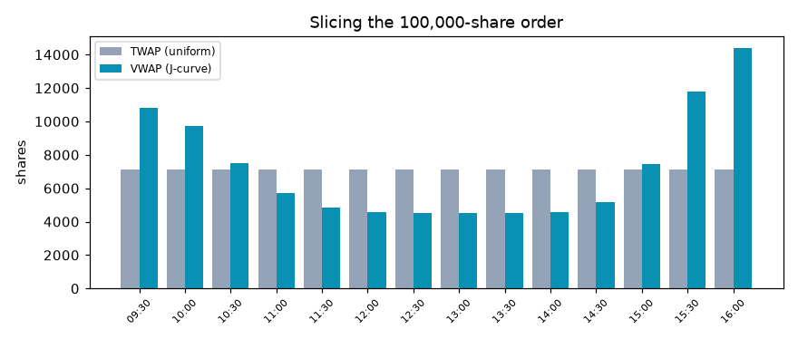
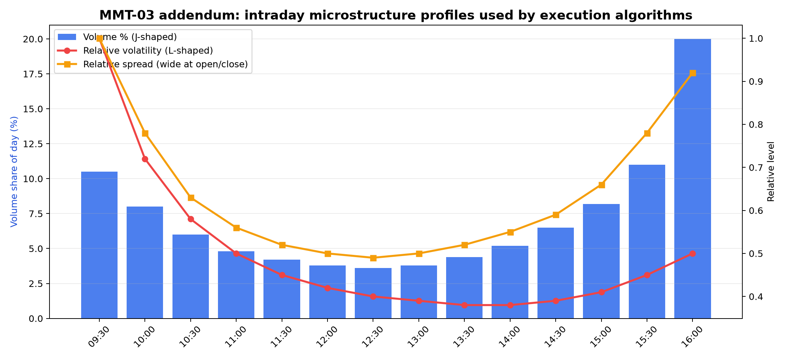

# Chapter 1. What Markets Are Actually Doing

## Why This Matters

A trading idea is not a trade yet.

You can have a clean chart, a clever signal, a strong backtest, and a convincing story about why a stock, future, ETF, currency pair, or option should move. None of that means you can actually earn the return shown on the screen. To earn anything, the idea must become an order. The order must interact with other orders. That interaction creates a fill: a quantity, a price, and a time.

This is the first practical reality of trading. The market does not pay you the signal return. It gives you the price and size that other participants are willing to trade, under the rules of the venue, at the moment your order arrives.

That difference matters. If your strategy assumes you can buy 100,000 shares at the last price, but only 2,000 shares are available near that price, the strategy is using imaginary liquidity. If your backtest buys at a daily close but your real order must be completed through a thin book during a volatile afternoon, the backtest is hiding the cost of trading. If your model expects 8 basis points of edge and your execution costs 12 basis points, the model may still forecast direction correctly while the trade loses money after costs.

Market structure is the part of trading that explains this gap between idea and fill. It includes the order book, bid-ask spread, depth, queue priority, participants, execution algorithms, venue behavior, market impact, and timing risk. This chapter begins the book here because every later topic depends on it. A strategy is not only a prediction. It is a prediction that must survive the market's liquidity, cost, and execution constraints.

By the end of this chapter, you should be able to look at a trading result and ask the question that separates paper trading from practical trading:

Could this order actually have been filled, in this size, at something close to the assumed price?

## Chapter Map

This chapter gives you five ideas that will keep returning throughout the book:

- A market is a matching system, not just a price chart. Prices appear because buyers and sellers submit orders under venue rules.
- Liquidity has shape. The best bid and best ask are only the top of the book; larger orders may need to trade through multiple price levels.
- Execution is a tradeoff. VWAP, TWAP, and POV schedules are different ways to manage urgency, market impact, benchmark tracking, and completion risk.
- Participants have incentives. Institutions, brokers, liquidity providers, retail traders, proprietary firms, and high-frequency traders do not all want the same thing.
- Microstructure changes strategy design. A signal with positive paper alpha may be too costly, too large, too urgent, or too fragile to trade as written.

The hand-checkable example is a small order-book calculation. You will buy 40 shares from a five-level ask book and calculate the average fill price, slippage, and execution result by hand. The practice notebook then turns the same idea into execution schedules by comparing VWAP, TWAP, and POV against an intraday volume profile.

## Key Terms Before We Start

| Term | Plain-English Meaning | Why It Matters In Practice |
|---|---|---|
| Order | An instruction to buy or sell. | Every strategy becomes orders before it becomes profit or loss. |
| Fill | The executed part of an order, with quantity, price, and time. | A trader earns fills, not theoretical prices. |
| Bid | A price where someone is willing to buy. | An aggressive seller usually trades against bids. |
| Ask | A price where someone is willing to sell. | An aggressive buyer usually trades against asks. |
| Spread | The gap between the best bid and best ask. | It is the immediate cost of crossing the market. |
| Order book | The visible stack of bids and asks at different prices. | It shows available displayed liquidity, not unlimited liquidity. |
| Depth | The quantity available at each price level. | Large orders may have to trade through several levels. |
| Queue priority | The rule that decides which resting order gets filled first. | A limit order can have a good price and still wait behind other orders. |
| Market order | An order that seeks immediate execution against available liquidity. | It improves fill certainty but can pay spread and impact. |
| Limit order | An order that trades only at a specified price or better. | It controls price but may not fill. |
| Slippage | The difference between expected reference price and actual execution price. | It is one way paper assumptions become real trading cost. |
| Market impact | Price movement caused by the act of trading. | Larger or more urgent orders can move the market against themselves. |
| VWAP | Volume-weighted average price. | It is both an execution benchmark and a volume-following schedule. |
| TWAP | Time-weighted average price. | It spreads trading evenly through time. |
| POV | Percentage of volume. | It trades as a chosen share of actual market volume. |
| Adverse selection | Getting filled when the other side has better timing or information. | A fill that looks cheap can still be bad if price moves against you afterward. |

## Plain-English Explanation

A market is a system for matching buyers and sellers. The chart shows the history of traded prices, but the order book shows the current willingness to trade.

Imagine a stock with a best bid of 100.00 and a best ask of 100.50. The best bid means someone is currently willing to buy at 100.00. The best ask means someone is currently willing to sell at 100.50. If you want to sell immediately, you can usually hit the bid. If you want to buy immediately, you can usually lift the ask. The spread is 0.50.

The spread is not the only cost. The best ask might only show 15 shares. If you need 5 shares, that may be enough. If you need 40 shares, the first 15 shares fill at 100.50, and the remaining 25 shares need to trade against the next ask level. The quote at 100.50 was real, but it was not a promise that all 40 shares could be bought at 100.50.

This is why liquidity is not just "can I trade?" Liquidity has price, size, and time.

- Price: At what price can I trade?
- Size: How much can I trade at that price?
- Time: How quickly can I trade without moving the market too much?

The simplest way to think about execution is to separate three things:

1. The signal says what you want to do.
2. The order says how you try to do it.
3. The fill says what actually happened.

Most beginner strategy work focuses on the first item. Practical trading depends on all three.

## Markets As A Matching And Liquidity System

The core job of an electronic market is matching orders under rules. Those rules define what prices can be quoted, which orders can interact, how priority is assigned, and what information is displayed.

The last traded price is only one output of this system. It tells you where a transaction happened in the past. It does not tell you how much you can trade now, whether your order will wait in a queue, how much spread you will pay, or how much your trade will move the next price.

This matters because most trading research begins with a historical price table. A daily table might show:

| Date | Close |
|---|---:|
| Monday | 100.00 |
| Tuesday | 101.00 |

That table is useful for return calculations, but it hides the trading process. It does not show the bid, ask, spread, depth, intraday volume, queue position, order type, fees, partial fills, or time required to complete a larger order. If a backtest buys at 100.00 and sells at 101.00, it has not yet answered the execution question.

Market structure forces you to translate price history into tradable assumptions. You begin asking:

- Would I buy with a market order or a limit order?
- How wide was the spread?
- How much depth existed near the quote?
- Was volume concentrated near the open and close?
- Was my order small relative to typical volume?
- Would my order reveal information or create impact?
- Would waiting improve price or increase the risk of missing the trade?

Those questions do not replace alpha research. They protect it. They tell you whether a signal can survive the act of trading.

## Order Book Depth, Spread, And Queue Priority

An order book has two sides. Bids are buy interest. Asks are sell interest. The best bid is the highest displayed buy price. The best ask is the lowest displayed sell price. The difference is the bid-ask spread.

Depth is the quantity available at each level. A book can have a narrow spread but thin depth. That means the first price looks attractive, but not much size is available there. A book can also have wider spread but deeper displayed quantity. Which is better depends on what you need to trade.

For a small market buy, the best ask may be enough. For a larger market buy, the order may "walk the book." Walking the book means consuming the best ask, then the next ask, then possibly more levels until the order is filled. The average fill price becomes worse than the best ask.

Limit orders introduce a different problem: queue priority. Suppose you place a limit buy at 100.00. You are willing to buy only at 100.00 or better. That controls price, but it does not guarantee a fill. If other traders already posted buy orders at 100.00, they may be ahead of you. If sellers never reach that price, you may not trade. If you do get filled, it may be because selling pressure has become strong enough to push price lower.

The basic order-type tradeoff is:

| Choice | What You Gain | What You Give Up |
|---|---|---|
| Market order | Immediate execution and higher fill certainty | Price control, spread, and possible market impact |
| Limit order | Price discipline and possible spread capture | Fill certainty and time priority |
| Sliced execution algorithm | Smaller footprint for large orders | Simplicity and immediate completion |

This is not a theoretical distinction. If a strategy depends on frequent entry and exit, spread and missed fills may decide whether the strategy is tradable. If a portfolio rebalance needs large size, depth and participation constraints may matter more than the signal itself.

## Execution Benchmarks: VWAP, TWAP, And POV

Large orders are often split into smaller child orders. The full intended order is the parent order. The smaller pieces sent through time are child orders.

Three common execution ideas are VWAP, TWAP, and POV.

VWAP stands for volume-weighted average price. As a benchmark, VWAP asks: what was the average traded price, weighted by volume, over a period? As a schedule, a VWAP-style algorithm tries to trade more during periods when the market normally trades more. If volume is usually heavy near the open and close, a VWAP schedule will tend to allocate more shares there.

TWAP stands for time-weighted average price. A TWAP-style schedule splits the order evenly across time. If you have ten time buckets and 100,000 shares, a simple TWAP schedule sends about 10,000 shares per bucket. It is easy to understand, but it can ignore the fact that real market volume is not evenly distributed through the day.

POV stands for percentage of volume. A POV schedule trades as a fixed share of actual market volume. If the market trades 50,000 shares in a bucket and your POV rate is 10 percent, your schedule targets 5,000 shares. POV adapts to realized volume, but it may not finish by a deadline if market volume is too low.

The point is not that one schedule is always best. The point is that each schedule solves a different execution problem.

| Schedule | Main Logic | Practical Strength | Practical Weakness |
|---|---|---|---|
| VWAP | Follow expected volume profile | Useful when benchmark tracking matters | Can be predictable and profile-dependent |
| TWAP | Trade evenly through time | Simple and deadline-friendly | Can ignore liquidity variation |
| POV | Trade as a share of actual volume | Adapts to real market activity | May not complete if volume is too low |

Schedule choice is a trading decision. It depends on order size, urgency, spread, depth, volatility, benchmark, and risk of non-completion.

## Participants, Incentives, And Adverse Selection

Markets contain participants with different objectives. A long-only institution rebalancing a portfolio does not behave like a high-frequency liquidity provider. A retail trader entering a small order does not have the same footprint as a fund liquidating a large position. A broker handling client orders may be paid differently from a proprietary firm trading its own capital.

The incentives matter because every order interacts with someone else.

| Participant | Common Role | Incentive To Watch |
|---|---|---|
| Institution | Builds or rebalances large positions | Needs liquidity without excessive impact |
| Broker | Executes client orders or commits capital | May earn commission or principal spread |
| Liquidity provider | Posts bids and asks | Seeks spread, rebates, and controlled inventory risk |
| Proprietary trader | Trades firm capital | Seeks trading profits under risk limits |
| High-frequency trader | Uses speed and short-horizon signals | Seeks small edges, queue priority, and order-flow information |
| Retail trader | Trades smaller personal orders | Often seeks access and simplicity |

Adverse selection is the risk that the other side of your trade has better timing or information. A passive limit order may appear attractive because it avoids crossing the spread. But if it gets filled mainly when price is about to move against it, the apparent spread saving may disappear. A midpoint or dark-pool fill may look clean, but hidden liquidity can still expose you to selection effects.

This is why "better price" and "better trade" are not always the same thing. Better execution means the order achieved its objective after considering price, size, time, information leakage, risk, and opportunity cost.

## Why Market Microstructure Changes Strategy Design

Microstructure changes how you evaluate a strategy before you ever run a complex backtest.

If a strategy trades very frequently, a small spread can dominate returns. A one-cent spread is not small if the strategy targets only a few cents per trade. If a strategy trades illiquid names, depth and impact may matter more than the forecast. If a strategy depends on a fast signal, waiting for a passive limit fill may lose the opportunity. If a strategy trades a portfolio rebalance, a VWAP-style schedule may be more relevant than a single trade price.

This means strategy design must include execution assumptions early:

- Universe selection should consider liquidity, not just signal quality.
- Position size should consider volume and depth, not just expected return.
- Holding period should consider turnover and spread.
- Backtests should distinguish gross results from net, cost-aware results.
- Execution method should match the objective: urgent trade, benchmark trade, patient trade, or participation trade.

The practical lesson is simple: paper alpha must become executable alpha. Executable alpha is what remains after spread, impact, timing risk, fees, missed fills, and operational constraints.

## Detailed Hand-Checkable Example

Now we make the idea concrete.

Suppose you want to buy 40 shares immediately. The visible ask side of the order book is:

| Ask level | Ask price | Ask quantity |
|---:|---:|---:|
| 1 | 100.50 | 15 |
| 2 | 101.00 | 35 |
| 3 | 101.50 | 5 |
| 4 | 102.50 | 2 |
| 5 | 103.00 | 15 |

You send a market buy order for 40 shares. A market buy consumes the lowest available asks first.

Step 1: Fill as much as possible at the best ask.

| Ask level | Ask price | Available quantity | Shares filled | Cash spent |
|---:|---:|---:|---:|---:|
| 1 | 100.50 | 15 | 15 | 1,507.50 |

After this, you still need 25 shares because:

`40 - 15 = 25`

Step 2: Move to the next ask level.

| Ask level | Ask price | Available quantity | Shares filled | Cash spent |
|---:|---:|---:|---:|---:|
| 2 | 101.00 | 35 | 25 | 2,525.00 |

The next level has 35 shares available, so the remaining 25 shares can be filled there.

Step 3: Add the fills.

| Ask level | Ask price | Shares filled | Cash spent |
|---:|---:|---:|---:|
| 1 | 100.50 | 15 | 1,507.50 |
| 2 | 101.00 | 25 | 2,525.00 |
| Total |  | 40 | 4,032.50 |

The order is completely filled, but it did not fill at the best ask. It filled across two price levels.

The average fill price is:

`4,032.50 / 40 = 100.8125`

The best ask when the order arrived was 100.50. The actual average fill price was 100.8125. The difference is:

`100.8125 - 100.50 = 0.3125 per share`

That 0.3125 is not a commission. It is the cost of demanding more immediate liquidity than existed at the best ask. In a larger real order, the same logic can scale into a meaningful cost.

Common mistake: looking at the best ask of 100.50 and assuming all 40 shares could be bought there. The book never said that. It showed 15 shares at 100.50.

Connection to practice: the notebook practice later asks how to avoid trading a large parent order all at once. VWAP, TWAP, and POV are schedule choices that respond to the same problem shown in this small example: immediate execution can be costly when available liquidity is limited.

## Formula Or Logic Only After Intuition

The formulas are simple, but they should come after the intuition. The hard part is not the arithmetic. The hard part is remembering that a quoted price is not the same thing as an executable price for unlimited size.

### Average Fill Price

`average fill price = total cash spent / total shares filled`

Each term:

- Total cash spent is the sum of price times quantity for every fill.
- Total shares filled is the number of shares actually bought.
- Average fill price is measured in currency per share.

What increases it for a buy order:

- More shares filled at higher ask levels.
- Thinner depth at the best ask.
- Wider spreads or fast upward price movement while the order is being filled.

What decreases it for a buy order:

- More available quantity near the best ask.
- A more patient execution style that avoids consuming high ask levels.
- Better timing, if liquidity improves before execution.

How a trader uses it:

- To compare actual execution with the arrival price, best ask, midprice, VWAP, or another benchmark.
- To decide whether the order size was too large relative to available liquidity.

What makes it misleading:

- Looking only at average fill price without asking how much of the order was left unfilled.
- Comparing fills to the wrong benchmark.
- Ignoring fees, rebates, and opportunity cost.

### Slippage

For this buy example:

`slippage per share = average fill price - reference price`

If the reference price is the best ask of 100.50:

`slippage per share = 100.8125 - 100.50 = 0.3125`

Each term:

- Average fill price is the actual weighted price of all fills.
- Reference price is the benchmark you expected or chose for comparison.
- Slippage is measured in currency per share, or converted into basis points.

What increases slippage for a buy order:

- Larger order size.
- Less sell-side depth.
- Higher urgency.
- Rising prices during execution.

What decreases slippage:

- Smaller order size.
- More depth near the quote.
- Patient execution.
- Better participation in periods of higher natural volume.

How a trader uses it:

- To test whether an execution method is preserving the strategy's edge.
- To compare market orders, limit orders, VWAP, TWAP, POV, or broker algorithms.

What makes it misleading:

- Choosing an easy benchmark after the fact.
- Ignoring missed fills or opportunity cost.
- Treating slippage as only a broker problem when the strategy itself demands too much liquidity.

### Execution Result

A practical trading result can be framed as:

`net expected result = signal edge - spread cost - market impact - timing cost - fees`

Each term:

- Signal edge is the expected return before execution costs.
- Spread cost is the cost of crossing from bid to ask or ask to bid.
- Market impact is the adverse price movement caused by your own order.
- Timing cost is the loss from waiting while the market moves.
- Fees include commissions, exchange fees, taxes, and other explicit charges.

What increases the net result:

- Larger genuine signal edge.
- Lower spread.
- More available depth.
- Better execution schedule.
- Lower turnover.

What decreases the net result:

- High turnover.
- Thin liquidity.
- Urgent execution.
- Unstable signal timing.
- Poor cost assumptions.

How a trader uses it:

- To reject trades where expected edge is too small for the required execution cost.
- To resize orders.
- To choose a more liquid universe.
- To decide whether the signal needs a longer holding period or stronger entry threshold.

What makes it misleading:

- Estimating signal edge from clean historical prices and subtracting only commission. For many strategies, spread, impact, timing risk, and missed fills matter more than explicit commission.

## Visual Anchor

The source folders contain useful visuals for Chapter 1, so this draft uses copied source charts instead of creating decorative figures.

*Figure 1.1. Order-book depth. The useful point is not the decoration of the chart; it is the shape of liquidity around the current market. Quantity is distributed across price levels, so a larger order may receive multiple fill prices.*

Figure 1.1 supports the hand example. The best price is only one level. Depth tells you whether that price is large enough for your order.

*Figure 1.2. Execution schedule comparison. VWAP, TWAP, and POV slice a parent order differently because they answer different execution problems: follow expected volume, follow time, or follow actual market participation.*

Figure 1.2 connects the order-book example to large-order execution. If trading everything immediately walks the book, a trader may slice the order through time or volume.

*Figure 1.3. Intraday profiles. Volume, volatility, and spread conditions vary through the day. A schedule that ignores this profile can trade too much when liquidity is weak or too little when liquidity is naturally available.*

Figure 1.3 matters for the practice notebook. VWAP, TWAP, and POV cannot be interpreted without understanding how volume and spread conditions change through the trading day.

## Real Trading Interpretation

The trading interpretation is that execution assumptions belong inside strategy design, not after it.

If a signal works only before costs, it is not enough. If a strategy needs to trade more size than the market can absorb, the backtest is too optimistic. If the holding period is short and turnover is high, the spread may be the strategy's largest opponent. If the strategy trades during low-volume windows, intraday liquidity matters. If the order must finish quickly, impact may be the price of urgency.

This changes the questions a trader asks:

- Do I need immediacy, or can I wait?
- Is the order small or large relative to visible depth and expected volume?
- Is the strategy judged against arrival price, VWAP, close, or another benchmark?
- Can partial fills damage the strategy?
- Is a missed trade better or worse than a costly fill?
- Does the expected edge still survive realistic spread, impact, timing risk, and fees?

The answer may be to trade smaller, trade a more liquid universe, use a longer holding period, require stronger expected edge, change the execution schedule, or reject the trade.

The central professional habit is to turn every strategy result into a net-of-execution question. Gross alpha is only the starting point. Executable alpha is the part that remains after the market charges you for liquidity, speed, information, and operational friction.

## What Can Go Wrong

The first failure is treating the best quote as if it applies to unlimited size. The hand example shows why this is wrong. The best ask was 100.50, but only 15 shares were available there. A 40-share market buy filled at an average price of 100.8125.

The second failure is ignoring the spread. A backtest that buys and sells at the same midprice or close price may be giving the strategy free liquidity. The damage grows with turnover.

The third failure is ignoring queue priority. A limit order may show a good price in the backtest, but the real order may sit behind other orders and fail to fill. If a backtest assumes every limit order fills whenever price touches the limit, it may be too generous.

The fourth failure is choosing an execution schedule by name instead of by objective. VWAP, TWAP, and POV are not interchangeable. VWAP follows expected volume. TWAP follows the clock. POV follows actual market volume. A strategy that must finish by a fixed deadline may not be suitable for a low-participation POV schedule. A strategy that wants to reduce footprint may not want a predictable TWAP pattern.

The fifth failure is confusing passive execution with safe execution. A limit order can avoid crossing the spread, but it can also miss the trade or get filled mainly when the market is moving against it. That is adverse selection.

The sixth failure is treating hidden liquidity, dark pools, midpoint fills, maker-taker rebates, or smart routing as free improvement. They may help, but each has assumptions, routing logic, information risk, and venue behavior behind it.

The seventh failure is forgetting that microstructure and alpha interact. A signal that is useful for small size may fail at institutional size. A signal that is useful in liquid stocks may fail in thin names. A signal that is useful with a daily holding period may fail if implemented intraday with high turnover.

## Practice Now

> **Concept practiced:** Market participants, algorithm categories, execution schedules, and intraday trading profiles.
>
> **Exact code folder:** `Week 5-2 MMT-03 code`
>
> **Exact notebook path:** `Week 5-2 MMT-03 code/Week 5-2 MMT-03 Overview of Electronic and Algorithmic_validated_practice.ipynb`
>
> **Exact notebook section/cell heading:** `## Part 3 - Slicing schedules: VWAP, TWAP, POV`
>
> **Exact data file used:** `Week 5-2 MMT-03 code/mmt03_intraday_profiles.csv`
>
> **Step-by-step actions:**
>
> 1. Open the validated MMT03 practice notebook.
> 2. Find the section titled `## Part 3 - Slicing schedules: VWAP, TWAP, POV`. If your local notebook displays an encoding artifact around the dash, search for `Part 3` and `Slicing schedules`.
> 3. Run or inspect the cells that compare VWAP, TWAP, and POV schedules.
> 4. Open or inspect `mmt03_intraday_profiles.csv`.
> 5. Look at the columns `bucket`, `volume_pct`, `relative_volatility`, and `relative_spread`.
> 6. Compare the schedule output with the intraday profile chart or table.
> 7. Ask what each schedule is trying to control: impact, benchmark tracking, participation, urgency, or completion.
>
> **What output appears:** Schedule/profile tables and charts comparing execution styles across the trading day.
>
> **Values, columns, charts, or tables to inspect:** Inspect `volume_pct`, `relative_volatility`, `relative_spread`, schedule shares, cumulative schedule shares, and the VWAP/TWAP/POV schedule chart.
>
> **Mistake to check for:** Do not conclude that VWAP, TWAP, and POV are interchangeable just because they all slice orders. They solve different execution problems.
>
> **One-sentence conclusion you should be able to write:** "The schedule choice changes the tradeoff between urgency, market impact, benchmark tracking, and completion risk."

## How To Read The Practice Output

The practice output is not trying to prove that one algorithm is always superior. It is showing that execution schedules encode different assumptions.

Good output should make the schedules visibly different. A TWAP schedule should look relatively even across time. A VWAP-style schedule should lean toward periods with higher expected volume. A POV schedule should respond to realized or assumed market volume. If all three schedules look identical, either the schedule logic is too simplified, the input profile is too flat, or the reader is not comparing the right columns.

The intraday profile matters because market conditions change through the day. If volume is high near the open and close, a VWAP schedule may concentrate more there. If spreads and volatility are elevated in some buckets, the trader must ask whether urgency justifies trading during those windows.

Weak output would be output that shows only a schedule table without volume, spread, or volatility context. That is still useful as a programming exercise, but it is not enough for an execution decision. A schedule is not meaningful unless it is connected to liquidity conditions and the objective of the order.

The connection to the hand example is direct. In the hand example, one urgent order walks the book. In the practice notebook, the trader responds to that problem by slicing the parent order through time or volume. The same liquidity problem appears at two scales.

You understand the practice if you can explain, without reading code, why:

- TWAP is simple but can ignore liquidity.
- VWAP tracks an expected volume pattern but can be benchmark-focused and profile-dependent.
- POV adapts to actual volume but may fail to complete by a deadline.
- Schedule choice depends on size, urgency, volume, spread, volatility, and benchmark.

## Master Recap: What To Remember One Year From Now

- **Core mental model:** A market is a matching and liquidity system. A strategy becomes real only when orders become fills.
- **Key terms:** bid, ask, spread, order book, depth, queue priority, market order, limit order, fill, slippage, market impact, VWAP, TWAP, POV, adverse selection.
- **Key formula:** `average fill price = total cash spent / total shares filled`. For a buy order, `slippage = average fill price - reference price`.
- **Decision rule:** Do not trust paper alpha until it survives spread, depth, queue behavior, market impact, timing risk, missed fills, and fees.
- **Main worked example lesson:** A 40-share market buy could not fully trade at the best ask because only 15 shares were available there. It walked to the next ask level and filled at an average price of 100.8125.
- **Practice notebook memory:** The MMT03 schedule section compares VWAP, TWAP, and POV against intraday trading profiles. Remember it as the bridge from "do not trade everything at once" to concrete execution schedules.
- **Common traps:** assuming close prices are freely tradable, ignoring spread, ignoring depth, over-crediting limit orders, treating VWAP/TWAP/POV as interchangeable, and confusing paper alpha with executable alpha.
- **Final decision checklist:** Before trusting a trade, ask: How big is the order relative to depth and volume? What spread will I pay? What impact might I create? How urgent is the signal? What benchmark matters? What execution schedule fits the objective? Is expected alpha still positive after realistic costs?

## Check Yourself

1. Conceptual: Why is a market more than a price chart?
   - **Answer hint:** A chart shows past trades. A market also contains current bids, asks, depth, queues, order types, participants, and venue rules that determine future fills.

2. Calculation: A market buy fills 15 shares at 100.50 and 25 shares at 101.00. What is the average fill price?
   - **Expected answer:** Total cash is 4,032.50. Total shares are 40. Average fill price is 100.8125.

3. Interpretation: If the best ask was 100.50 and the average fill price was 100.8125, what is slippage versus the best ask?
   - **Expected answer:** 0.3125 per share for this buy order.

4. Failure mode: Why can a backtest that buys at the close overstate performance?
   - **Answer hint:** The close is a reference price, not guaranteed executable liquidity. The backtest may ignore spread, depth, impact, timing risk, partial fills, and fees.

5. Practice-output question: In the MMT03 schedule practice, what should you compare across VWAP, TWAP, and POV?
   - **Answer hint:** Compare schedule shape, cumulative shares, volume dependence, and how the schedule relates to `volume_pct`, `relative_volatility`, and `relative_spread`.

6. Real-world decision: If you must finish a large order quickly in a thin book, what tradeoff are you accepting?
   - **Answer hint:** You are accepting higher spread cost, market impact, and slippage to reduce timing risk and completion risk.

7. Execution choice: Why is a passive limit order not automatically better than a market order?
   - **Answer hint:** It controls price but may not fill, may wait behind other orders, and may be adversely selected when it does fill.

8. Strategy design: What should you change if a signal has positive gross alpha but loses money after realistic execution costs?
   - **Answer hint:** Possible changes include reducing turnover, using a more liquid universe, resizing, changing holding period, changing execution schedule, raising the signal threshold, or rejecting the strategy.

## Bridge To The Next Chapter

This chapter showed that a trade idea must pass through market structure before it can become a real result. Chapter 2 builds on that foundation by asking what makes an observation a tradable edge in the first place. Once you understand that every signal must become orders and fills, you can define strategy rules with more discipline.
